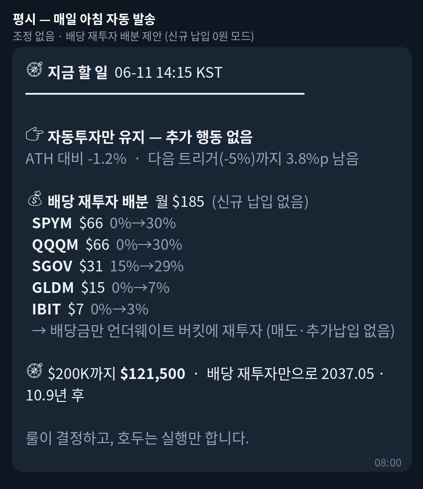
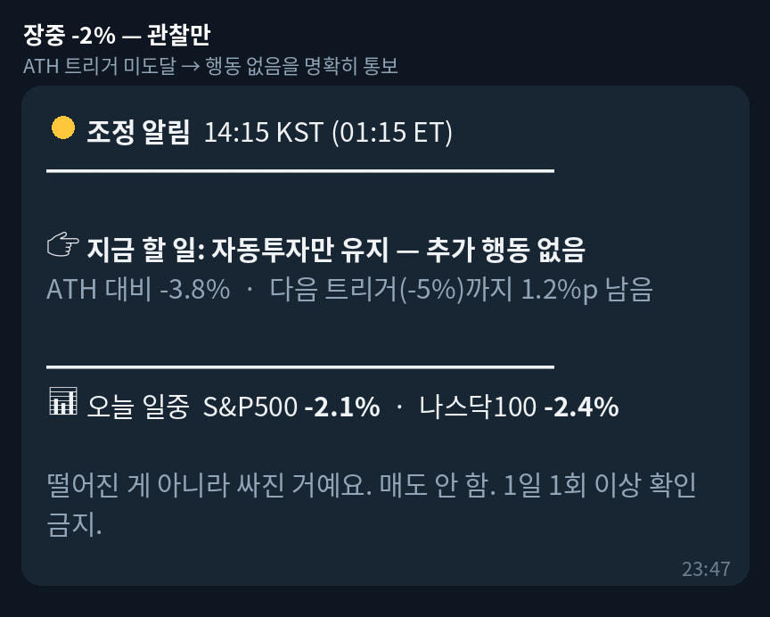
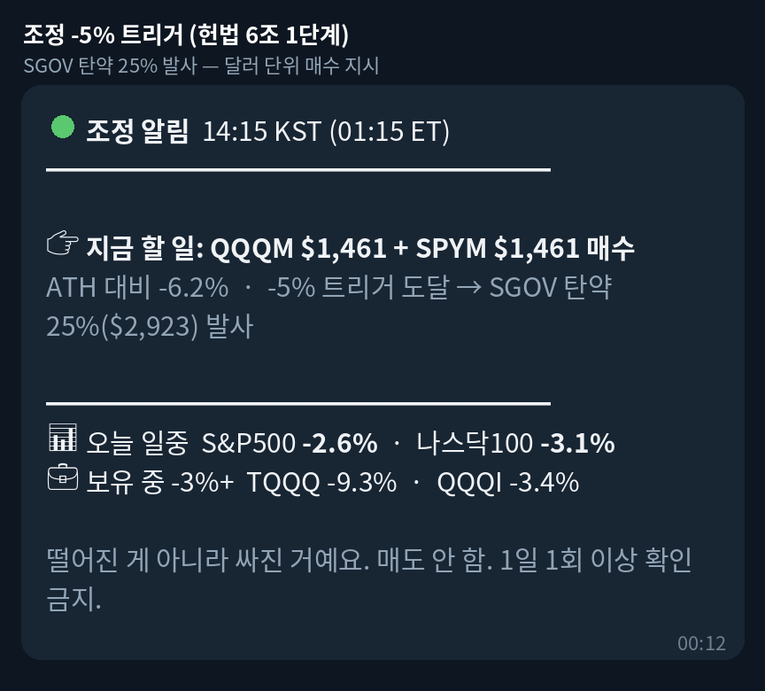
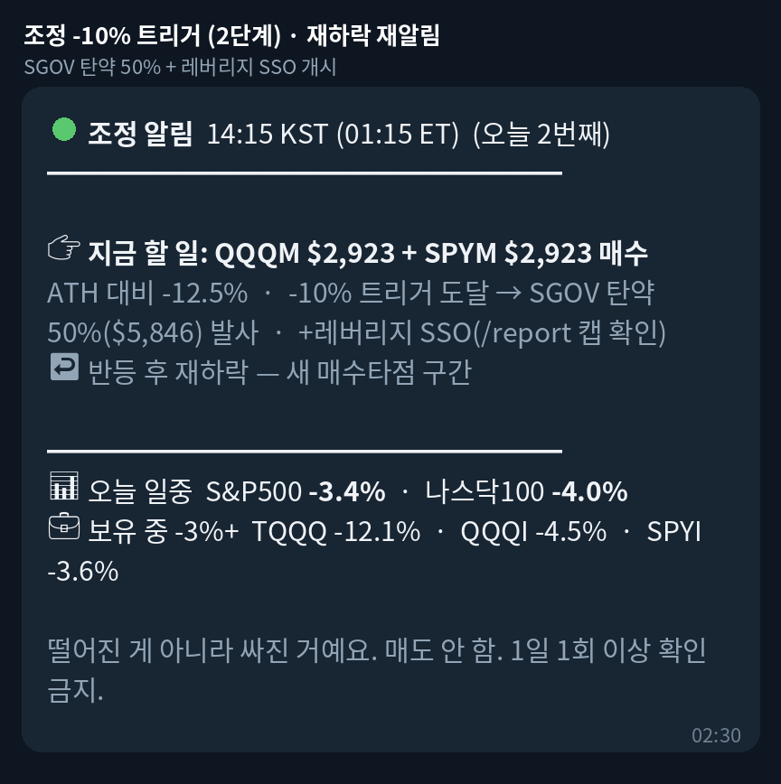
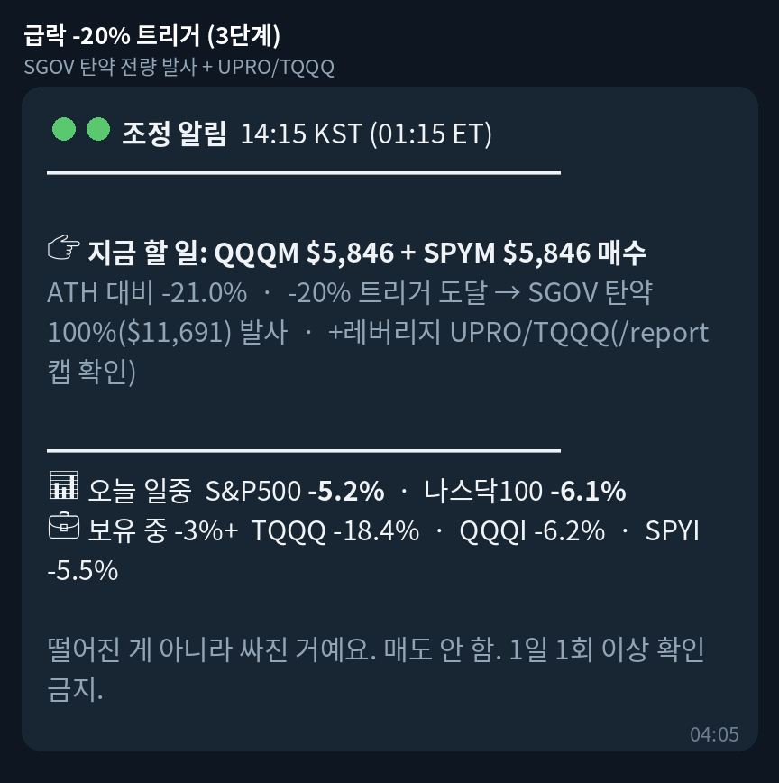
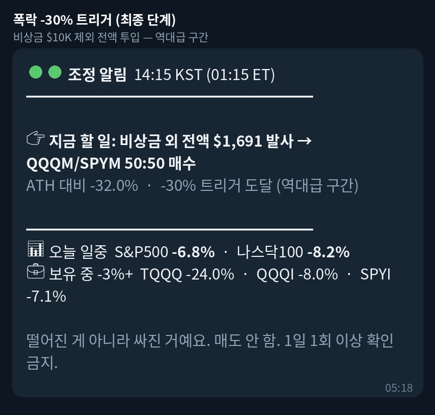
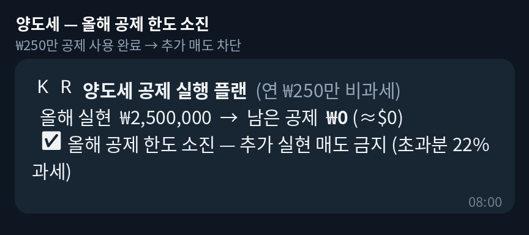
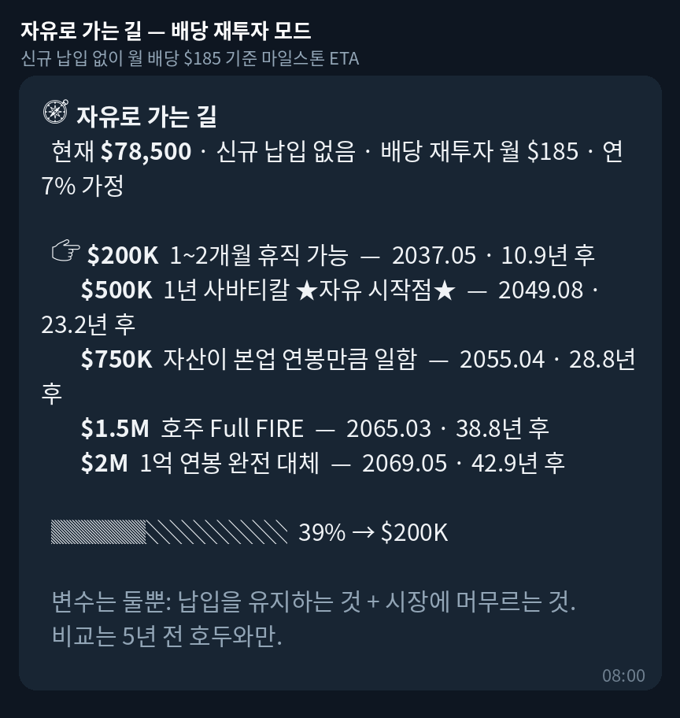

# 상황별 알림 예시

봇이 상황별로 텔레그램에 자동 발송(일방향 푸시)하는 메시지 예시.
실제 빌더 함수(`intraday_alert._build_alert`, `action_plan.build_now_message`,
`tax_korea.build_tax_message`, `action_plan.build_goal_message`)를 mock 시세로
호출해 생성한 실제 출력이다.

## 1. 평시 — 매일 아침 자동 발송

조정 없음. 헌법 6조 트리거 판정 결과("자동투자만 유지")와 배당 재투자 배분
(신규 납입 0원 모드)을 제안. 데일리 리포트 상단/하단에 포함된다.

## 2. 장중 -2% — 관찰만

지수가 일중 -2% 빠졌지만 ATH 누적 낙폭이 트리거 미도달 → "추가 행동 없음"을
명확히 통보해 충동 매매를 차단.

## 3. 조정 -5% 트리거 (헌법 6조 1단계)

SGOV 탄약 25% 발사. 몇 달러로 뭘 사야 하는지 단일 행동으로 제시.

## 4. 조정 -10% 트리거 (2단계) — 반등 후 재하락 재알림

SGOV 탄약 50% + 레버리지 SSO 개시. 반등 후 재하락 시 같은 단계 재알림
(새 매수타점, 1일 최대 6회).

## 5. 급락 -20% 트리거 (3단계)

SGOV 탄약 전량 발사 + UPRO/TQQQ.

## 6. 폭락 -30% 트리거 (최종 단계)

비상금 $10K 제외 전액 투입 — 역대급 구간.

## 7. 양도세 — 올해 공제 한도 소진

연 ₩250만 공제 사용 완료(`KR_CGT_REALIZED_KRW_OVERRIDE`) → 추가 실현 매도를
차단하고 그 사실만 통보.

## 8. 자유로 가는 길 — 배당 재투자 모드

신규 납입 없이(월 납입 0원) 예상 월 배당만 재투자할 때의 마일스톤 도달 시기.

